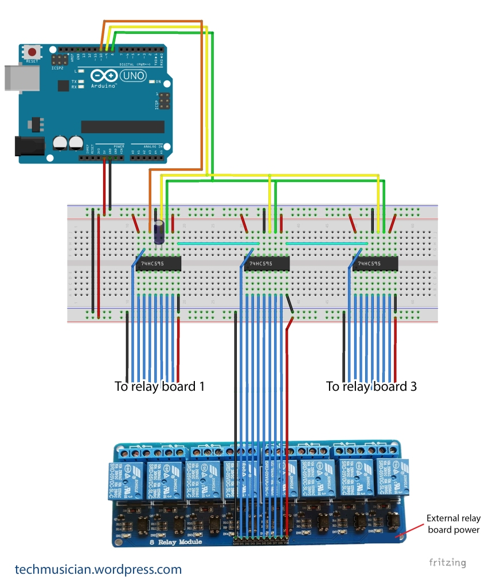

# lightShow
Using virtual MIDI signals to control multiple relays to turn lights ON / OFF. 

This is small project done recently for our Society's Ganpati Festival.

The original idea was picked from https://techmusician.wordpress.com/.

- I've added few MIDI Projects that we had performed during the festival.
- Also few programs that will keep the light glowing in a random manner.

## Watch the youtube video:  

## Circuit Diagram  

